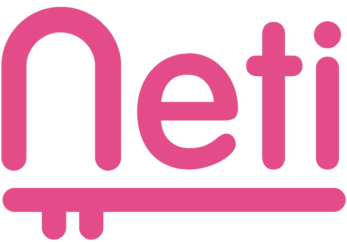

<div align="center">



# NETI — Laboratorio de Innovación

**Sitio web oficial de NETI, laboratorio de innovación que combina tecnologías exponenciales con lógicas de diseño y co-creación.**

[](https://react.dev/)
[](https://vitejs.dev/)
[](https://tailwindcss.com/)
[](https://netlify.com/)

[🌐 Ver sitio en vivo](https://noestatodoinventado.com) · [📸 Instagram](https://www.instagram.com/netimakers/) · [💼 LinkedIn](https://www.linkedin.com/company/no-est-todo-inventado-neti-/) · [✍️ Medium](https://noestatodoinventado.medium.com/)

</div>

---

## 📋 Descripción

NETI es un laboratorio de innovación que trabaja con empresas e instituciones para desarrollar soluciones de alto impacto. Este repositorio contiene el código fuente del sitio web oficial, construido con un stack moderno y un design system consistente basado en la identidad visual de la marca.

El sitio incluye información institucional, presentación del equipo, metodología Doble Diamante, el programa de **Liderazgo Disruptivo**, y próximamente secciones de servicios, eventos y contacto.

---

## 🎨 Design System

| Token | Valor | Uso |
|-------|-------|-----|
| `fuchsia` | `#EC4E8D` | Acento principal, títulos outline, botones |
| `cyan` | `#00D8ED` | Acento secundario, íconos |
| `dark-purple` | `#251B37` | Textos, cuerpo |
| `purple-gray` | `#85789A` | Textos secundarios, footer |
| `white` | `#FFFFFF` | Fondo general |

**Tipografías:**
- **Tourney Black** — títulos display con efecto outline `-webkit-text-stroke`
- **IBM Plex Sans** — cuerpo, párrafos, labels

---

## 🛠️ Stack Tecnológico

| Tecnología | Versión | Rol |
|-----------|---------|-----|
| [React](https://react.dev/) | 19 | Framework UI |
| [Vite](https://vitejs.dev/) | 6 | Bundler y dev server |
| [Tailwind CSS](https://tailwindcss.com/) | v4 | Estilos utilitarios |
| [React Router DOM](https://reactrouter.com/) | 7 | Navegación SPA |
| [Google Fonts](https://fonts.google.com/) | — | Tipografías (Tourney + IBM Plex Sans) |

**Herramientas de desarrollo:**
- [Antigravity](https://antigravity.dev/) — IDE agent-first con Claude Opus 4.6
- [Google Stitch](https://stitch.withgoogle.com/) — generación de UI desde wireframes
- [Netlify](https://netlify.com/) — deploy continuo desde GitHub

---

## ⚙️ Instalación y desarrollo

```bash
# Clonar el repositorio
git clone https://github.com/tu-usuario/neti.git
cd neti

# Instalar dependencias
npm install

# Iniciar servidor de desarrollo
npm run dev

# Build para producción
npm run build
```

---

## 🌐 Deploy

El sitio se despliega automáticamente en **Netlify** con cada push a `main`.

Deploy final de producción: **Hostinger** vía FTP (dominio `noestatodoinventado.com`).

---

## 📬 Contacto & Redes

<div align="center">

| Red | Link |
|-----|------|
| 🌐 Web | [noestatodoinventado.com](https://noestatodoinventado.com) |
| 📸 Instagram | [@netimakers](https://www.instagram.com/netimakers/) |
| 💼 LinkedIn | [NETI en LinkedIn](https://www.linkedin.com/company/no-est-todo-inventado-neti-/) |
| ✍️ Medium | [noestatodoinventado.medium.com](https://noestatodoinventado.medium.com/) |

</div>

---

## 👨‍💻 Desarrollo

Desarrollado por **[Agustín Cervelló](https://agustincervello.netlify.app/)** para NETI.

---

<div align="center">
  <sub>© 2025 NETI — No Está Todo Inventado</sub>
</div>